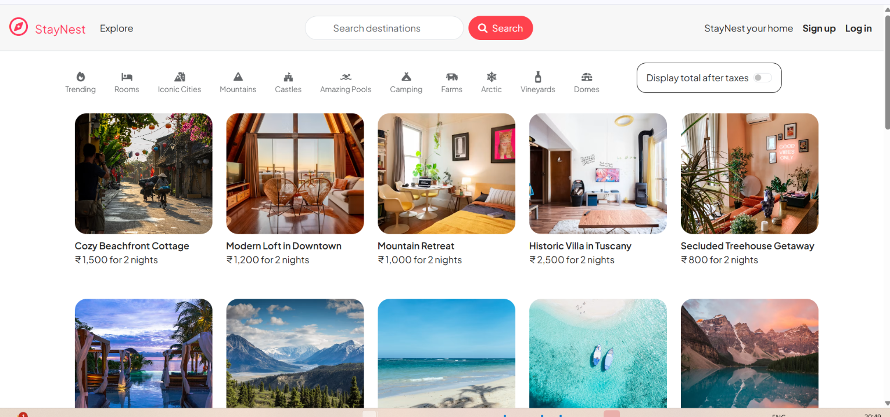
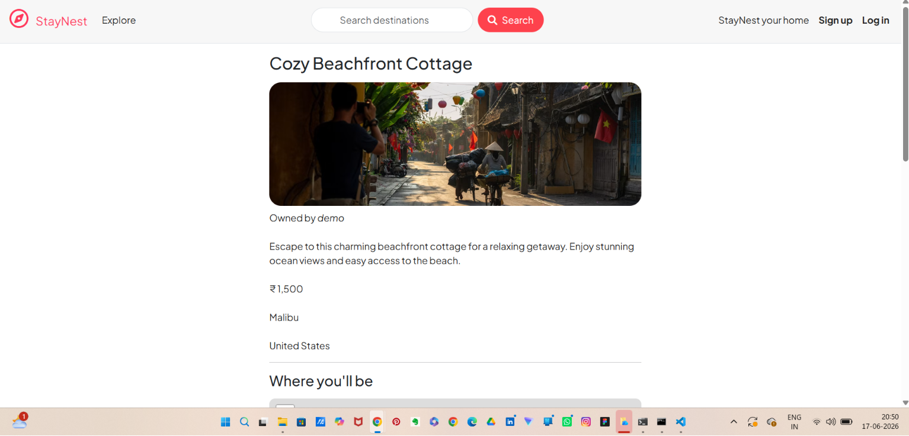
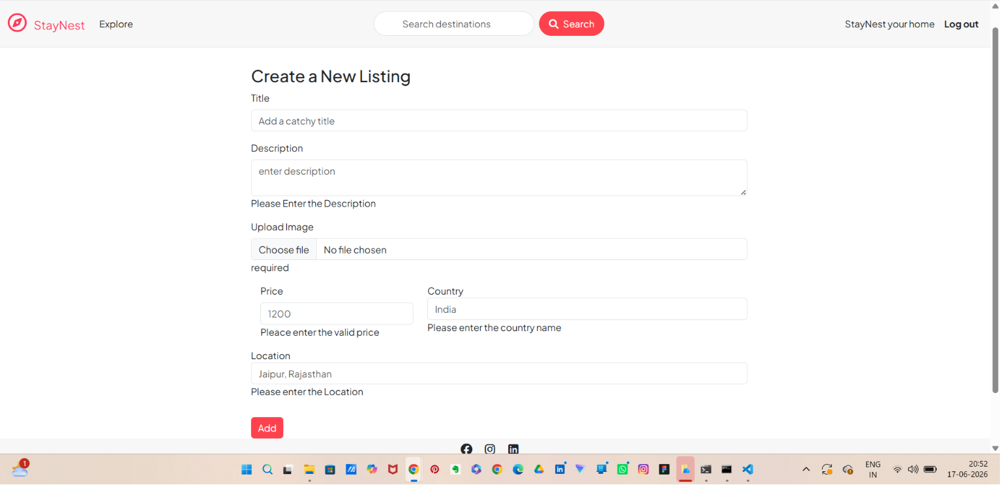
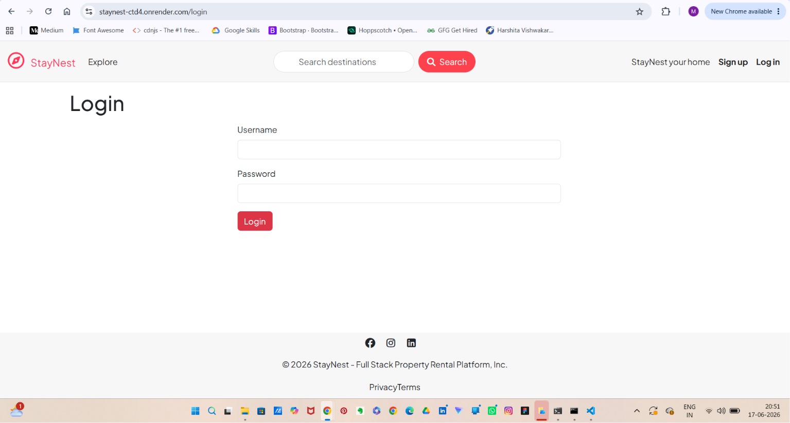
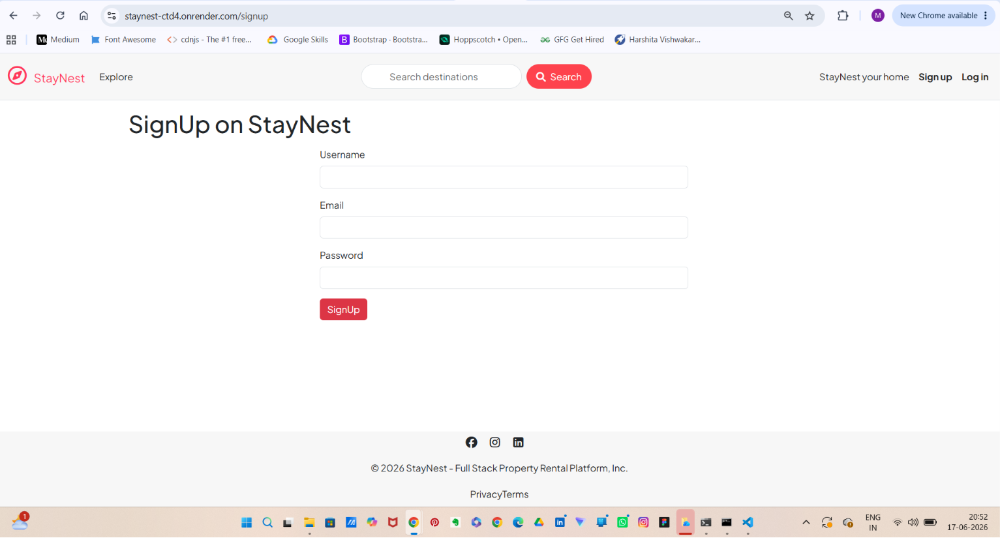

# 🏠 StayNest

StayNest is a full-stack property rental platform inspired by Airbnb, built using Node.js, Express.js, MongoDB Atlas, EJS, and Bootstrap.

## 🚀 Live Demo

https://staynest-ctd4.onrender.com

## 📌 Features

* User Authentication & Authorization
* Create, Edit and Delete Listings
* Property Search Functionality
* Interactive Maps
* Session Management
* Flash Messages
* Responsive User Interface
* MVC Architecture
* MongoDB Atlas Integration
* Render Deployment

## 🛠️ Tech Stack

## 📸 Screenshots

### Home Page
 

### Listing Details
 

### Create Listing
 

### Login
 

### Sign Up


## ⚙️ Installation

git clone https://github.com/mayankv14/StayNest.git

cd StayNest

npm install

npm start

## 🔐 Environment Variables

Create a .env file and add:

CLOUD_NAME=
CLOUD_API_KEY=
CLOUD_API_SECRET=

ATLASDB_URL=

SECRET=

## 🏗️ Architecture

- MVC (Model View Controller) Pattern
- RESTful Routing
- MongoDB Atlas Database
- Passport.js Authentication
- Express Sessions
- Cloudinary Image Storage

  ## 🚧 Challenges Faced

- Implementing authentication with Passport.js
- Integrating Cloudinary image uploads
- Deploying the application on Render
- Managing MongoDB Atlas connections
- Handling session-based authentication

### Frontend

* HTML
* CSS
* Bootstrap
* JavaScript
* EJS

### Backend

* Node.js
* Express.js

### Database

* MongoDB Atlas
* Mongoose

### Authentication

* Passport.js
* Express Session
* Connect Flash

### Deployment

* Render

## 📂 Project Structure

```text
controllers/
models/
routes/
views/
public/
utils/
```

## 🎯 What I Learned

* Building full-stack web applications
* MVC architecture
* Authentication and authorization
* Database integration with MongoDB Atlas
* Deployment using Render
* RESTful routing and middleware

## 🔮 Future Improvements

* Cloudinary Image Upload Integration
* Wishlist Feature
* Reviews & Ratings Enhancement
* Advanced Search Filters
* Booking System
* Payment Gateway Integration

## 👨‍💻 Author

B.Tech CSIT Student | Full-Stack Java & Web Development Enthusiast

GitHub: https://github.com/mayankv14
LinkedIn: https://www.linkedin.com/in/mayank-v14/
